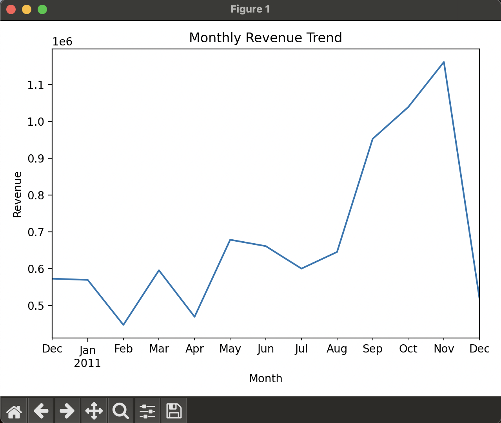
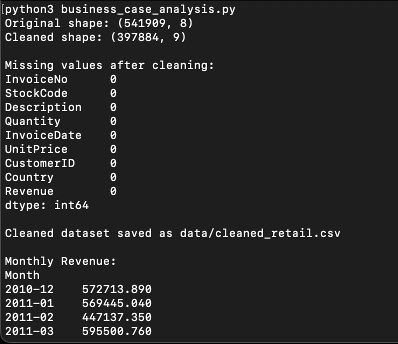
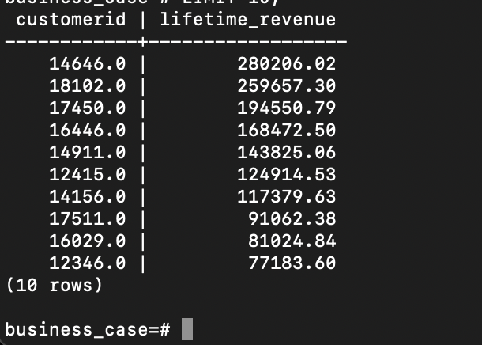

# 📊 Business Case: E-Commerce Revenue & Customer Analytics

Project Overview
This project presents an end-to-end data analytics case study for an online retail business.
It simulates how a data analyst works with transactional sales data to uncover revenue trends, segment customers, and deliver actionable business insights.
The analysis supports decision-making around customer retention, revenue growth, and marketing prioritization using Python and SQL.
The goal is to answer **business questions** such as:

- How is revenue trending over time?
- Who are the most valuable customers?
- Which customers are at risk of churn?
- How can the business increase repeat purchases?

---
Business Questions
The project addresses the following key business questions:
How is revenue trending over time?
Who are the most valuable customers?
Which customers are at risk of churn?
How can the business increase repeat purchases and customer lifetime value?
---

## 🧱 Tech Stack

- **Python** – pandas, matplotlib
- **PostgreSQL** – data warehouse & analytics
- **SQL** – business queries
- **Git/GitHub** – version control & portfolio hosting

---

## 📂 Project Structure

business-case/
├── data/
│   ├── online_retail.csv        # Raw dataset
│   ├── cleaned_retail.csv       # Cleaned dataset (Python)
│   └── rfm_customers.csv        # RFM segmentation output
├── notebooks/
│   └── business_case_analysis.py
├── sql/
│   └── analysis_queries.sql     # Business SQL queries
└── README.md

---

## 🧼 Data Cleaning (Python)

Using pandas, the dataset is prepared for analysis by:
 -Removing null and invalid records
 -Converting date and numeric fields
 -Creating a Revenue = Quantity × UnitPrice feature
 -Exporting a clean dataset for downstream analysis

```python
df = df.dropna()
df["InvoiceDate"] = pd.to_datetime(df["InvoiceDate"])
df["Revenue"] = df["Quantity"] * df["UnitPrice"]
df.to_csv("data/cleaned_retail.csv", index=False)
```
📈 Revenue Trend Analysis

Monthly revenue is aggregated to identify seasonality and growth patterns.

Key findings:
 -Clear revenue spikes during Q4
 -Strong seasonal demand toward year-end
 -Opportunities for revenue forecasting and inventory planning
 -This analysis mirrors stakeholder reporting commonly used in retail analytics.
 
👥 RFM Customer Segmentation

Each customer is scored on:
	•	Recency – days since last purchase
	•	Frequency – number of orders
	•	Monetary – total spend

Customers are classified into:
	•	Low Risk (repeat & recent buyers)
	•	High Risk (single-purchase or inactive)

Example output:
CustomerID | Recency | Frequency | Monetary
12346.0    | 326     | 1         | 77183.60
12347.0    | 2       | 7         | 4310.00

Churn distribution:
Low Risk   : 3491 customers
High Risk  : 847 customers

Business Insight: 
~20% of customers are at high churn risk, presenting an opportunity for targeted retention campaigns to convert first-time buyers into repeat customers.

🗄 PostgreSQL Data Warehouse

The cleaned data is loaded into PostgreSQL:
```
CREATE TABLE ecommerce (
    invoiceno TEXT,
    stockcode TEXT,
    description TEXT,
    quantity INTEGER,
    invoicedate TIMESTAMP,
    unitprice NUMERIC,
    customerid NUMERIC,
    country TEXT,
    revenue NUMERIC
);
Loaded with:
COPY ecommerce FROM '/path/cleaned_retail.csv'
WITH (FORMAT csv, HEADER true);
```

📊 Business SQL Examples

Saved in sql/analysis_queries.sql.

Top customers by lifetime value:
```
SELECT customerid,
       ROUND(SUM(revenue), 2) AS lifetime_revenue
FROM ecommerce
GROUP BY 1
ORDER BY lifetime_revenue DESC
LIMIT 10;
```
Sample result:
```
CustomerID | Lifetime_Revenue
14646      | 280206.02
18102      | 259657.30
17450      | 194550.79

These queries replicate what analysts deliver to:
	•	Marketing teams
	•	Finance
	•	Product managers
```

⸻

💡 Business Insights
	•	Revenue spikes in Q4 → strong seasonality
	•	A small customer group generates a large share of revenue
	•	~20% of customers are at high churn risk
	•	Retention campaigns can significantly improve LTV

⸻

🎯 Why This Project Matters

This project demonstrates:
	•	End-to-end analytics workflow
	•	Realistic business questions
	•	Production-style SQL
	•	Clean, documented, reproducible work
	•	Tools used in real analyst roles

It reflects the responsibilities of a junior to mid-level data analyst in an industry setting.

⸻

🚀 How to Run
```
cd notebooks
python3 business_case_analysis.py
```

PostgreSQL:
```
psql -U postgres -d business_case
\i sql/analysis_queries.sql
```

Portfolio Note
This repository is part of my data analyst portfolio and demonstrates practical business analytics using Python and SQL.

Then run:

```bash
git add README.md
git commit -m "Add full business case documentation"
git push origin main
```
## 📊 Analysis Outputs

### Monthly Revenue Trend


### Data Cleaning & RFM Output (Python)


### Top Customers by Lifetime Revenue (SQL)


