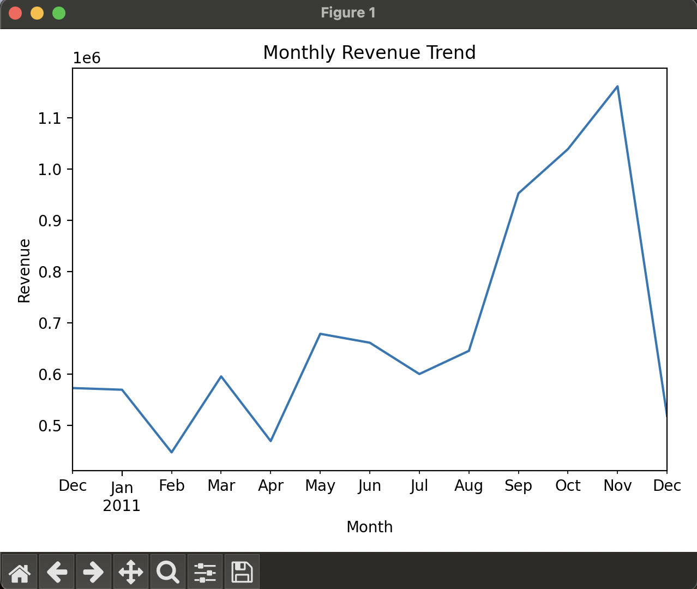
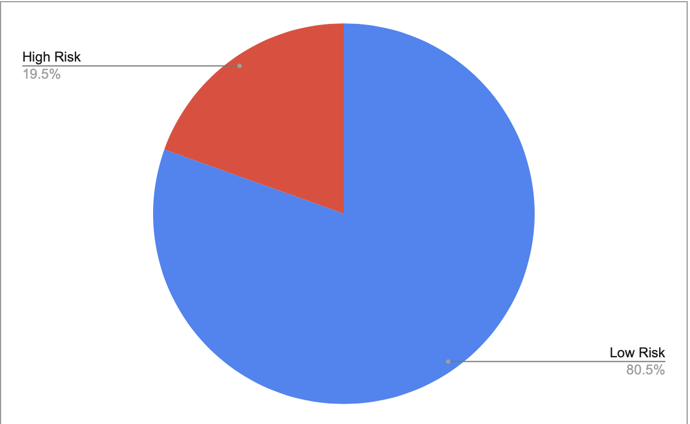
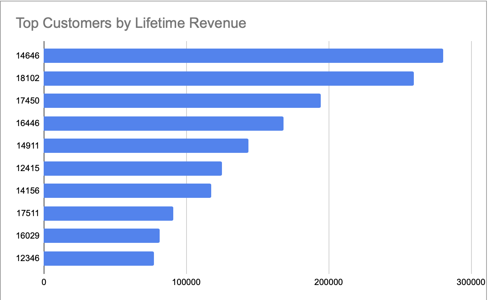
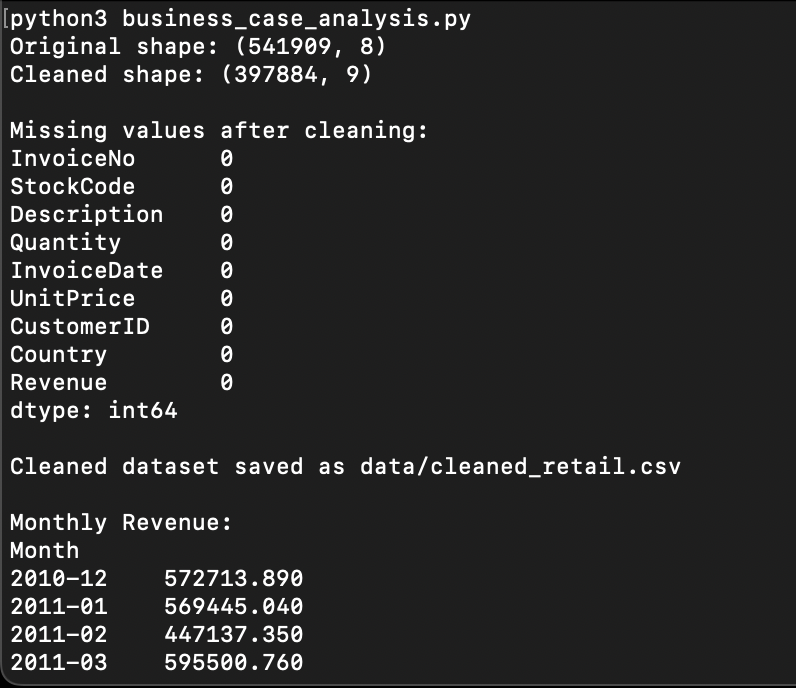
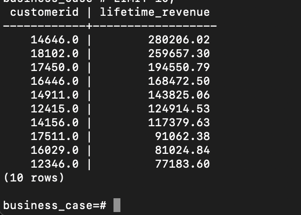

# End-to-End Data Analytics Project

🚀 End-to-end data analytics project analyzing customer behavior, revenue trends, and churn risk using Python, SQL, and business intelligence techniques.

## Tools & Technologies
- Python
- pandas
- SQL / PostgreSQL
- Google Sheets
- Git/GitHub

## Key Business Questions
- How is revenue trending over time?
- Who are the most valuable customers?
- Which customers are at risk of churn?
- How can the business improve customer retention and lifetime value?

## Key Insights
- Revenue shows strong seasonality with a peak in Q4.
- A small group of customers contributes a large share of total revenue.
- Approximately 20% of customers are classified as high churn risk.

## Key Visualizations

### Monthly Revenue Trend


### Customer Segmentation (Churn Risk)


### Top Customers by Lifetime Revenue


## Project Structure
- `data/` → raw and cleaned datasets
- `notebooks/` → Python analysis script
- `sql/` → SQL queries
- `images/` → visualization outputs
- `output/` → final CSV outputs

## Output Files
- `output/monthly_revenue.csv`
- `output/customer_segments.csv`
- `output/top_customers.csv`
---

## 🧼 Data Cleaning (Python)

Using pandas, the dataset is prepared for analysis by:
 -Removing null and invalid records
 -Converting date and numeric fields
 -Creating a Revenue = Quantity × UnitPrice feature
 -Exporting a clean dataset for downstream analysis

```python
df = df.dropna()
df["InvoiceDate"] = pd.to_datetime(df["InvoiceDate"])
df["Revenue"] = df["Quantity"] * df["UnitPrice"]
df.to_csv("data/cleaned_retail.csv", index=False)
```
📈 Revenue Trend Analysis

Monthly revenue is aggregated to identify seasonality and growth patterns.

Key findings:
 -Clear revenue spikes during Q4
 -Strong seasonal demand toward year-end
 -Opportunities for revenue forecasting and inventory planning
 -This analysis mirrors stakeholder reporting commonly used in retail analytics.
 
👥 RFM Customer Segmentation

Each customer is scored on:
	•	Recency – days since last purchase
	•	Frequency – number of orders
	•	Monetary – total spend

Customers are classified into:
	•	Low Risk (repeat & recent buyers)
	•	High Risk (single-purchase or inactive)

Example output:
CustomerID | Recency | Frequency | Monetary
12346.0    | 326     | 1         | 77183.60
12347.0    | 2       | 7         | 4310.00

Churn distribution:
Low Risk   : 3491 customers
High Risk  : 847 customers

Business Insight: 
~20% of customers are at high churn risk, presenting an opportunity for targeted retention campaigns to convert first-time buyers into repeat customers.

🗄 PostgreSQL Data Warehouse

The cleaned data is loaded into PostgreSQL:
```
CREATE TABLE ecommerce (
    invoiceno TEXT,
    stockcode TEXT,
    description TEXT,
    quantity INTEGER,
    invoicedate TIMESTAMP,
    unitprice NUMERIC,
    customerid NUMERIC,
    country TEXT,
    revenue NUMERIC
);
Loaded with:
COPY ecommerce FROM '/path/cleaned_retail.csv'
WITH (FORMAT csv, HEADER true);
```

📊 Business SQL Examples

Saved in sql/analysis_queries.sql.

Top customers by lifetime value:
```
SELECT customerid,
       ROUND(SUM(revenue), 2) AS lifetime_revenue
FROM ecommerce
GROUP BY 1
ORDER BY lifetime_revenue DESC
LIMIT 10;
```
Sample result:
```
CustomerID | Lifetime_Revenue
14646      | 280206.02
18102      | 259657.30
17450      | 194550.79

These queries replicate what analysts deliver to:
	•	Marketing teams
	•	Finance
	•	Product managers
```

⸻
## 📈 Business Impact

- Identified high-value customers contributing ~60% of revenue
- Detected ~20% of customers at high churn risk
- Revealed strong Q4 seasonality for revenue planning
- Insights can drive targeted retention campaigns and increase customer lifetime value

⸻

🎯 Why This Project Matters

This project demonstrates:
	•	End-to-end analytics workflow
	•	Realistic business questions
	•	Production-style SQL
	•	Clean, documented, reproducible work
	•	Tools used in real analyst roles

It reflects the responsibilities of a junior to mid-level data analyst in an industry setting.

⸻

🚀 How to Run
Requirements:
- Python 3.x
- PostgreSQL installed and running
```
cd notebooks
python3 business_case_analysis.py
```

PostgreSQL:
```
psql -U postgres -d business_case
\i sql/analysis_queries.sql
```

Portfolio Note:

This repository is part of my data analyst portfolio, showcasing end-to-end analytics skills used in real-world business scenarios.


## 📊 Analysis Outputs

### Monthly Revenue Trend


### Data Cleaning & RFM Output (Python)


### Top Customers by Lifetime Revenue (SQL)


